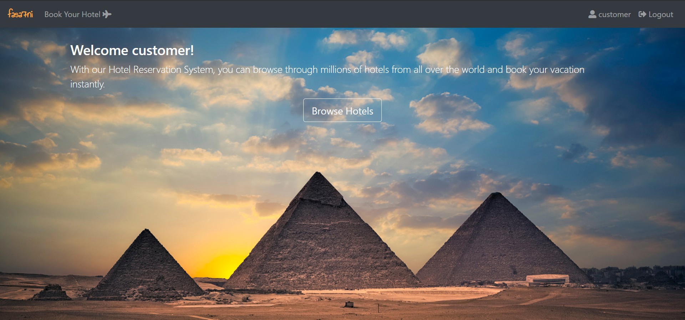
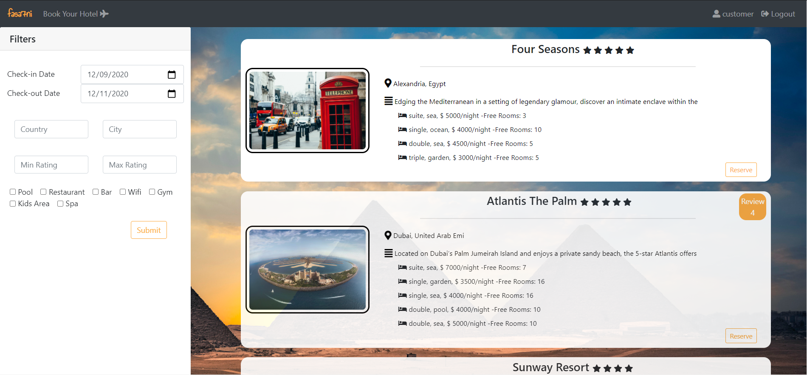
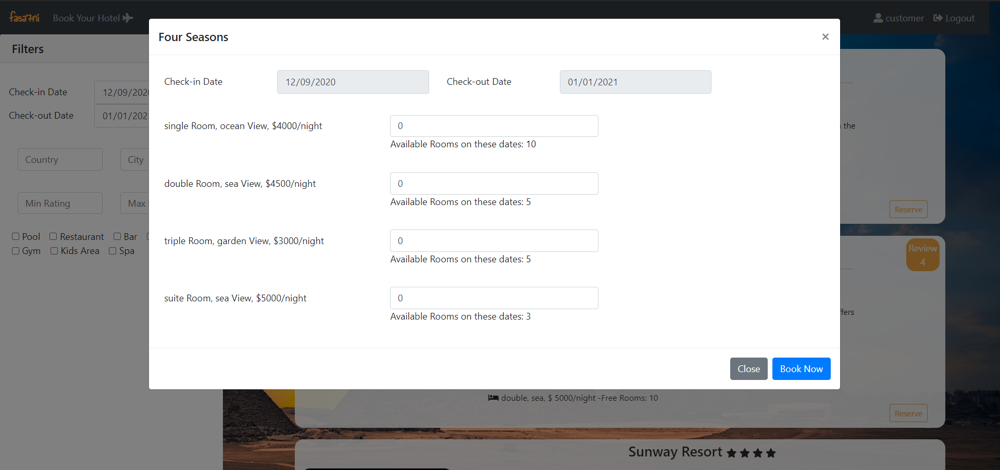
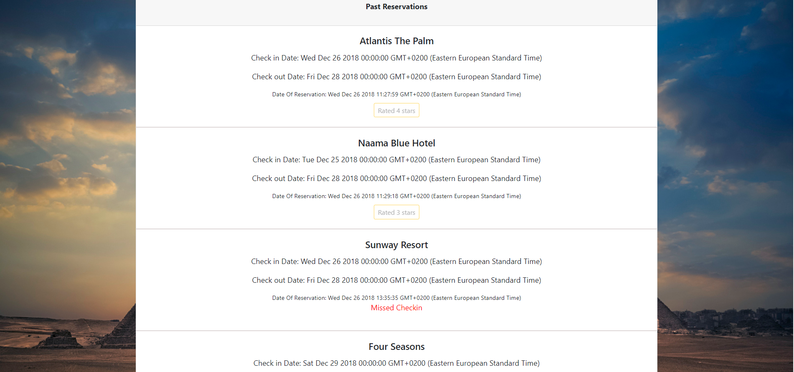
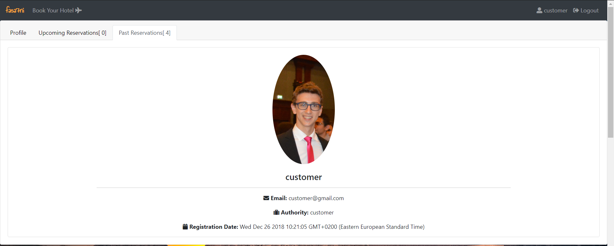
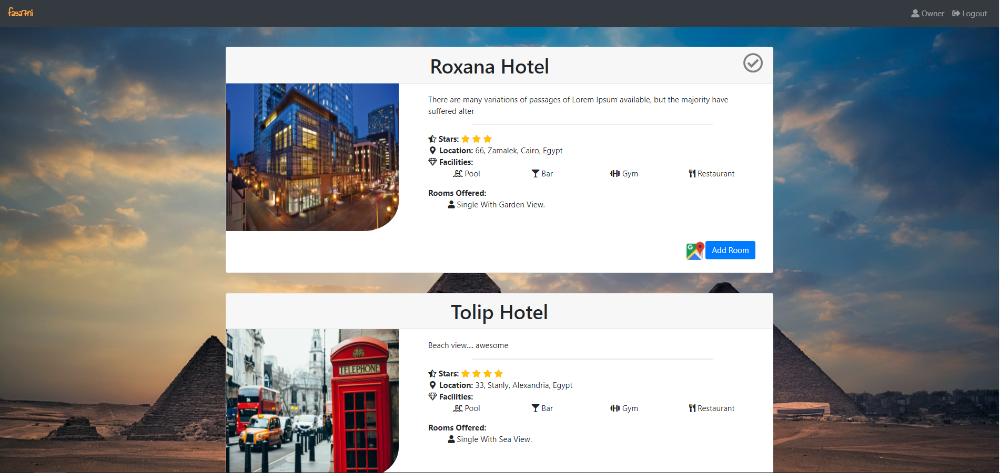
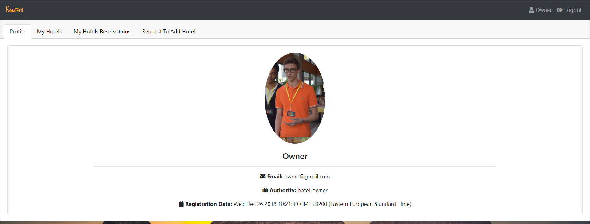
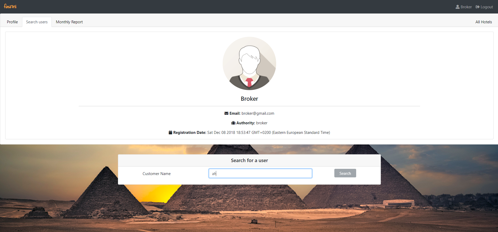
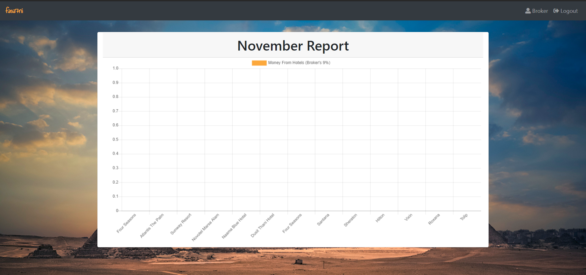
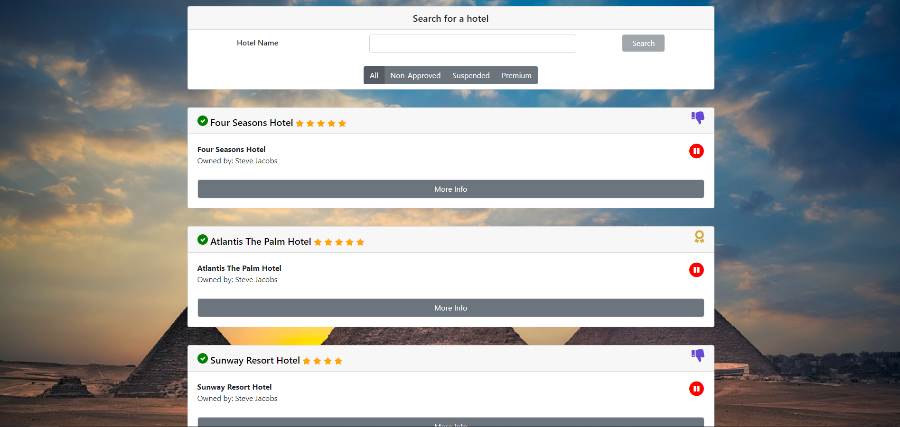

# Fasa7ni

Hotel Reservation System built using nodejs, express and mysql

1. Customer can:
    - Browse all hotels
    - Filter the hotels according to: Price, Rating, Dates of checkin and checkout, Location, Facilities.
    - Reserve rooms in a hotel on specific dates (Rooms are shown with price, view and type)
    - View hotel's page for more info and it's location on google maps and check the customer's reviews
    - Browse upcoming reservations and check status
    - Cancel upcoming reservation
    - Browse past reservations
    - Rate and review past reservations (if checked in)
    
    
    
    
    

2. Hotel Owner can:
    - Request to add new hotel
    - Add rooms to his hotels (type, view, price, number of rooms)
    - Browse reservations in his hotels
    - Approve or cancel reservation
    - Filter his hotels' reservation by reservation state(Pending, Approved, Cancelled), reservation interval(upcoming, past), check-in dates and check-out dates.
    - Confirm if guest checked in or not
    
    
    

3. Admin can:
    - Search all users to blacklist anyone
    - Check monthly report on the money owed by the hotels(9% of each reservation)
    - Browse all hotels and their owners
    - Filters on hotels by non-approved, suspended, premium
    - Approve a new hotel addition
    - Give premium features to hotels
    - Suspend a hotel
    
    
    
    

